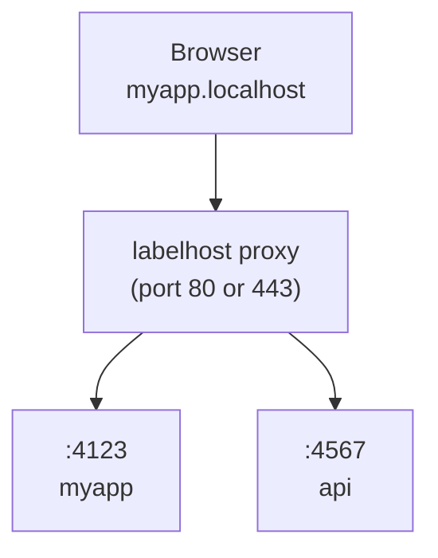

# labelhost

Replace port numbers with stable, named .localhost URLs for local development. For humans and agents.

```diff
- "dev": "next dev"                  # http://localhost:3000
+ "dev": "labelhost run next dev"     # https://myapp.localhost
```

## About this fork

labelhost is a fork of [portless](https://github.com/vercel-labs/portless) by Vercel Labs, maintained by [Wataru Nishimura](https://github.com/WataruNishimura). It is not affiliated with, endorsed by, or supported by Vercel.

The fork tracks upstream `main` and merges it periodically, so bug fixes and features from portless land here too. On top of upstream, labelhost changes the following:

- **Renamed CLI, package, and state.** The command and npm package are `labelhost`, per-user state lives in `~/.labelhost`, environment variables use the `LABELHOST_*` prefix, and the local CA (`labelhost Local CA`), launchd label (`dev.labelhost.proxy`), and systemd unit (`labelhost.service`) carry the new name. This lets labelhost be installed and run alongside upstream portless without colliding.
- **`hostnameTemplate` config field.** A per-app hostname pattern with `{{name}}` and `{{worktree}}` placeholders. See [Config fields](#config-fields).
- **Pkl config.** Config can be written in `labelhost.pkl`, amending a shipped schema so a misspelled property or an out-of-range value fails at evaluation time. See [Pkl config](#pkl-config).
- **Upstream config compatibility.** `portless.json` and a `"portless"` key in `package.json` are still read, so a project already set up for portless works without changes. `PORTLESS_*` environment variables are not read; use `LABELHOST_*` instead.

Report fork-specific issues in [this repository](https://github.com/WataruNishimura/portless/issues). An issue that also reproduces with upstream portless is best reported [upstream](https://github.com/vercel-labs/portless/issues).

labelhost is licensed under the Apache License 2.0, the same license as portless. See [LICENSE](LICENSE) and [NOTICE](NOTICE) for attribution details.

## Install

**Global (recommended):**

```bash
npm install -g labelhost
```

**Or as a project dev dependency:**

```bash
npm install -D labelhost
```

> labelhost is pre-1.0. When installed per-project, different contributors may run different versions. The state directory format may change between releases, which can require re-running `labelhost trust`.

## Run your app

```bash
labelhost myapp next dev
# -> https://myapp.localhost
```

HTTPS with HTTP/2 is enabled by default. On first run, labelhost generates a local CA, trusts it, and binds port 443 (auto-elevates with sudo on macOS/Linux). Use `--no-tls` for plain HTTP.

The proxy auto-starts when you run an app. A random port (4000-4999) is assigned via the `PORT` environment variable. Most frameworks (Next.js, Express, Nuxt, etc.) respect this automatically. For frameworks that ignore `PORT` (Vite, VitePlus, Astro, React Router, Angular, Expo, React Native), labelhost auto-injects the right `--port` flag and, when needed, a matching `--host` flag. Injection reaches through a package script whose command starts with the framework or a known runner (`"dev": "vite"`, `"dev": "bunx vite"`). Only the framework's server commands get the flags (`dev`, `serve`, `preview`, `start`, a bare `vite`, or `vite [root]`); a command that does not serve, such as `vite build`, `vite optimize`, `vp test` or `astro check`, rejects them and is left alone. Expo connection modes (`--localhost`, `--lan`, `--tunnel`) are preserved while the assigned port is still injected. A script labelhost cannot classify is left alone too: a flag before the subcommand on a CLI whose flag grammar it does not track (`vp --mode dev build`). Labelhost also leaves a script alone when appending flags to it would not work: a compound command (`&&`, `|`, `;`), a trailing `#` comment, its own `--` option terminator, an env prefix (`NODE_ENV=production vite`), delegation to another script (`"dev": "npm run dev:vite"`), or runner flags before the script name (`bun run --bun dev`). Those keep their own port, so set it in the script yourself.

When auto-starting, labelhost reuses the configuration (port, TLS, TLDs) from the most recent proxy run, so a restart or reboot does not silently revert to defaults. Explicit env vars (`LABELHOST_PORT`, `LABELHOST_HTTPS`, etc.) always take priority.

Labelhost stores per-user state in `~/.labelhost`. When the proxy runs under sudo, it resolves this path from the invoking user's home so the proxy and unprivileged app processes share the same route registrations.

In non-interactive environments (no TTY, or `CI=1`), labelhost exits with a descriptive error instead of prompting, so task runners like turborepo and CI scripts fail early with a clear message.

## Configuration

Bare `labelhost` works out of the box. It runs the `"dev"` script from `package.json` through the proxy, inferring the app name from the package name, git root, or directory:

```bash
labelhost        # -> runs "dev" script, https://<project>.localhost
```

Use an optional `labelhost.json` to override defaults (config is read from `labelhost.pkl`, then `labelhost.json`, then `portless.json`, then a `"labelhost"` or `"portless"` key in `package.json`):

```json
{ "name": "myapp" }
```

```bash
labelhost        # -> runs "dev" script, https://myapp.localhost
```

The script defaults to `"dev"`. The name is inferred from `package.json` if not set in config.

### Monorepo

One `labelhost.json` at the repo root covers all workspace packages. Labelhost discovers packages from `pnpm-workspace.yaml`, or the `"workspaces"` field in `package.json` (npm, yarn, bun):

```json
{
  "apps": {
    "apps/web": {
      "name": "myapp",
      "hostnameTemplate": "{{worktree}}.{{name}}.dev"
    },
    "apps/api": { "name": "api.myapp" }
  }
}
```

```bash
labelhost        # from repo root: starts all workspace packages with a "dev" script
cd apps/web && labelhost   # start just one package
```

The `apps` map is optional and only needed for name or hostname-template overrides. Packages not listed still auto-discover with names inferred from their `package.json`.

Without an `apps` map, hostnames follow the `<package>.<project>.localhost` convention. The project name comes from the most common npm scope across workspace packages (e.g. `@myorg/web` and `@myorg/api` produce `myorg`), falling back to the workspace root directory name. If a package's short name matches the project name, it gets the bare `<project>.localhost` without duplication.

### Config fields

| Field              | Type    | Default  | Description                                               |
| ------------------ | ------- | -------- | --------------------------------------------------------- |
| `name`             | string  | inferred | Base app name. Worktree prefix still applies.             |
| `hostnameTemplate` | string  |          | Hostname pattern. Supports `{{name}}` and `{{worktree}}`. |
| `script`           | string  | `"dev"`  | Name of a `package.json` script to run.                   |
| `appPort`          | number  | auto     | Fixed port for the child process.                         |
| `proxy`            | boolean | auto     | Whether to route through the proxy. Auto-detected.        |
| `apps`             | object  |          | Overrides for workspace packages, keyed by relative path. |
| `turbo`            | boolean | `true`   | Set `false` to use direct spawning instead of turborepo.  |

`hostnameTemplate` is evaluated before labelhost adds the proxy TLD. `{{name}}` is the configured or inferred app name and `{{worktree}}` is the linked-worktree branch prefix. If there is no worktree prefix, its complete dot-delimited label is removed. For example, `{{worktree}}.{{name}}.dev` resolves to `myapp.dev.localhost` in the primary checkout and `feature-auth.myapp.dev.localhost` in a linked worktree.

### Pkl config

Instead of JSON, config can be written in [Pkl](https://pkl-lang.org). Put a
`labelhost.pkl` next to your `package.json` and amend the shipped schema:

```pkl
amends "https://raw.githubusercontent.com/WataruNishimura/portless/main/packages/labelhost/pkl/Labelhost.pkl"

name = "myapp"
hostnameTemplate = "{{worktree}}.{{name}}.dev"

apps {
  ["apps/web"] { appPort = 3000 }
  ["apps/api"] { name = "api.myapp"; proxy = false }
}
```

Amending the schema is what makes this worth it: a misspelled property or an
out-of-range port fails at evaluation time, pointing at the offending line,
instead of being silently ignored the way an unknown JSON key is.

```
–– Pkl Error ––
Cannot find property `hostnmae` in module `Labelhost`.

2 | hostnmae = "typo"
    ^^^^^^^^
```

When the package is installed locally you can amend
`node_modules/labelhost/pkl/Labelhost.pkl` instead of fetching over HTTP.

This requires the [pkl CLI](https://pkl-lang.org/main/current/pkl-cli/index.html)
on `PATH`; set `LABELHOST_PKL_BIN` to point at it elsewhere. Only projects with
a `labelhost.pkl` need it. If a `labelhost.pkl` is present but cannot be
evaluated, labelhost reports the error rather than falling back to JSON, so a
broken config never starts an app under the wrong hostname.

### package.json "labelhost" key

Instead of a separate `labelhost.json`, you can add a `"labelhost"` key to your `package.json`. A string value is shorthand for setting the name:

```json
{
  "name": "@myorg/web",
  "labelhost": "myapp"
}
```

An object supports all per-app fields (`name`, `hostnameTemplate`, `script`, `appPort`, `proxy`):

```json
{
  "name": "@myorg/web",
  "labelhost": { "name": "myapp", "script": "dev:app" }
}
```

The `package.json` `"labelhost"` key takes precedence over `labelhost.json` app entries but is overridden by CLI flags.

### --script flag

Override the default script for a single invocation:

```bash
labelhost --script start       # run "start" instead of "dev"
labelhost --script test        # run "test" instead of "dev"
```

### Turborepo

To use labelhost with turborepo, put `labelhost` as the `dev` script and the real command in a separate script:

```json
{
  "scripts": {
    "dev": "labelhost",
    "dev:app": "next dev"
  },
  "labelhost": { "name": "myapp", "script": "dev:app" }
}
```

Turbo runs each package's `dev` script, which invokes labelhost. Labelhost reads the config, detects the package manager, and runs `pnpm run dev:app` (or yarn/bun/npm) through the proxy. No changes to `turbo.json` are needed.

`pnpm dev` at the root works through turbo as usual. People without labelhost can run `pnpm run dev:app` directly.

## Use in package.json

You can still use labelhost in `package.json` scripts:

```json
{
  "scripts": {
    "dev": "labelhost run next dev"
  }
}
```

With a `labelhost.json`, you can simplify to:

```json
{
  "scripts": {
    "dev": "next dev"
  }
}
```

Then run `labelhost` or `labelhost run` to go through the proxy.

## Subdomains

Organize services with subdomains:

```bash
labelhost api.myapp pnpm start
# -> https://api.myapp.localhost

labelhost docs.myapp next dev
# -> https://docs.myapp.localhost
```

By default, only explicitly registered subdomains are routed (strict mode). Use `--wildcard` when starting the proxy to allow any subdomain of a registered route to fall back to that app (e.g. `tenant1.myapp.localhost` routes to the `myapp` app without extra registration).

## Git Worktrees

`labelhost run` automatically detects git worktrees. In a linked worktree, the branch name is prepended as a subdomain so each worktree gets its own URL without any config changes:

```bash
# Main worktree (no prefix)
labelhost run next dev   # -> https://myapp.localhost

# Linked worktree on branch "fix-ui"
labelhost run next dev   # -> https://fix-ui.myapp.localhost
```

Use `--name` to override the inferred base name while keeping the worktree prefix:

```bash
labelhost run --name myapp next dev   # -> https://fix-ui.myapp.localhost
```

Put `labelhost run` in your `package.json` once and it works everywhere. The main checkout uses the plain name, each worktree gets a unique subdomain. No collisions, no `--force`.

## Custom TLD

By default, labelhost uses `.localhost` which auto-resolves to `127.0.0.1` in most browsers. If you prefer a different TLD (e.g. `.test`), use `--tld`:

```bash
labelhost proxy start --tld test
labelhost myapp next dev
# -> https://myapp.test
```

The proxy auto-syncs `/etc/hosts` for route hostnames (including `.test`), so those domains resolve on your machine.

Repeat `--tld` to serve the same app names under multiple TLDs from one proxy:

```bash
labelhost proxy start --tld localhost --tld test
labelhost myapp next dev
# -> https://myapp.localhost
# -> https://myapp.test
```

When multiple TLDs are configured, `LABELHOST_URL` uses the first TLD. `LABELHOST_TLD` also accepts a comma separated list, e.g. `LABELHOST_TLD=localhost,test`.

Recommended: `.test` (IANA-reserved, no collision risk). Avoid `.local` (conflicts with mDNS/Bonjour) and `.dev` (Google-owned, forces HTTPS via HSTS).

### Multi-segment TLDs

The `--tld` value accepts a lowercase DNS name (one or more dot-separated labels, no trailing dot), so a domain you own can be used as the "TLD". This gives local URLs the same structure as production, which keeps OAuth redirect URIs, cross-subdomain cookies, and host-based routing working the same way in both environments:

```bash
labelhost proxy start --tld dev.example.com
labelhost myapp next dev
# -> https://myapp.dev.example.com
```

Each label must follow DNS rules: lowercase letters, digits, and interior hyphens, with at most 63 characters per label and 253 characters total. The full hostname (`app.TLD`) is also subject to the 253-character DNS limit.

The proxy auto-syncs `/etc/hosts` for registered hostnames, so `myapp.dev.example.com` resolves to `127.0.0.1` on your machine. This is a loopback-only setup: outside LAN mode the proxy binds only to `127.0.0.1` and `::1` (see below), so a custom TLD is reachable only from the machine running the proxy. Reaching the proxy from other devices requires LAN mode (`--lan`), but LAN mode serves apps under the `.local` TLD and ignores a custom `--tld`, so the two cannot be combined today.

Strict OAuth providers (Google, Apple) reject `.localhost` and `.test` redirect URIs but accept a real domain, so `https://myapp.dev.example.com/api/auth/callback/google` works as a redirect URI.

## How it works



1. **Start the proxy**: auto-starts when you run an app, or start explicitly with `labelhost proxy start`
2. **Run apps**: `labelhost <name> <command>` assigns a free port and registers with the proxy
3. **Access via URL**: `https://<name>.localhost` routes through the proxy to your app

Outside LAN mode, the proxy and its HTTP redirect listener bind only to the IPv4 and IPv6 loopback addresses, `127.0.0.1` and `::1`. They do not accept connections through LAN, VPN, or other network interfaces.

## HTTP/2 + HTTPS

HTTPS with HTTP/2 is enabled by default. Browsers limit HTTP/1.1 to 6 connections per host, which bottlenecks dev servers that serve many unbundled files (Vite, Nuxt, etc.). HTTP/2 multiplexes all requests over a single connection.

WebSockets work over both protocol versions, so dev server HMR (Next.js, Vite, etc.) works through the proxy: HTTP/1.1 `Upgrade` requests are forwarded as-is, and WebSockets opened over an HTTP/2 connection use extended CONNECT (RFC 8441).

On first run, labelhost generates a local CA and adds it to your system trust store. No browser warnings. No manual setup.

```bash
# Use your own certs (e.g., from mkcert)
labelhost proxy start --cert ./cert.pem --key ./key.pem

# Disable HTTPS (plain HTTP on port 80)
labelhost proxy start --no-tls

# If you skipped the trust prompt on first run, trust the CA later
labelhost trust
```

On Linux, `labelhost trust` supports Debian/Ubuntu, Arch, Fedora/RHEL/CentOS, and openSUSE (via `update-ca-certificates` or `update-ca-trust`). On Windows, it uses `certutil` to add the CA to the system trust store. On WSL, it updates both the Linux trust store and the Windows current-user Root store so Windows browsers trust labelhost HTTPS certificates.

## Start at OS startup

Install the proxy as an OS startup service so clean HTTPS URLs are available after reboot without starting the proxy from a terminal:

```bash
labelhost service install
labelhost service install --lan
labelhost service install --wildcard
LABELHOST_STATE_DIR=~/.labelhost-lan LABELHOST_LAN=1 labelhost service install
labelhost service status
labelhost service uninstall
```

The service uses labelhost defaults unless install options or `LABELHOST_*` environment variables are provided: HTTPS on port 443 with `.localhost` names. `service install` accepts the proxy options you would use with `proxy start`, including `--port`, `--no-tls`, `--lan`, `--ip`, `--tld`, `--wildcard`, `--cert`, and `--key`. Use `--state-dir <path>` or `LABELHOST_STATE_DIR=<path>` to choose where service state and logs are written.

The chosen service configuration is written into launchd, systemd, or Task Scheduler and reused after reboot. `labelhost service status` reports the installed port, HTTPS mode, TLDs, LAN mode, wildcard mode, and state directory. macOS and Linux install a root-owned service so port 443 can bind at boot. Windows installs a Task Scheduler startup task that runs as SYSTEM. Installation and removal may require administrator privileges. `labelhost clean` automatically removes the service.

## LAN mode

```bash
labelhost proxy start --lan
labelhost proxy start --lan --https
labelhost proxy start --lan --ip 192.168.1.42
```

`--lan` explicitly binds the proxy to the IPv4 and IPv6 unspecified addresses, `0.0.0.0` and `::`, and switches to mDNS discovery. This makes services available as `<name>.local` to devices on the same network. Labelhost auto-detects your LAN IP and follows Wi-Fi/IP changes automatically, but you can pin another address with `--ip <address>` or by exporting `LABELHOST_LAN_IP`. Set `LABELHOST_LAN=1` in your shell (0/1 boolean) to make LAN mode the default whenever the proxy starts.

Labelhost remembers LAN mode via `proxy.lan`, so if you stop a LAN proxy and start it again, it stays in LAN mode. All proxy settings (port, TLS, TLDs, LAN) are persisted and reused on auto-start unless overridden by explicit flags or env vars. Use `LABELHOST_LAN=0` for one start to switch back to `.localhost` mode. If a proxy is already running with different explicit LAN/TLS/TLD settings, labelhost warns and asks you to stop it first.

LAN mode depends on the system mDNS tools that labelhost already spawns: macOS ships with `dns-sd`, while Linux uses `avahi-publish-address` from `avahi-utils` (install via `sudo apt install avahi-utils` or your distro’s equivalent). If the command is missing or your network isn’t reachable, `labelhost proxy start --lan` prints the relevant error and exits.

### Framework notes

- **Next.js**: add your `.local` hostnames to `allowedDevOrigins`:

  ```js
  // next.config.js
  module.exports = {
    allowedDevOrigins: ["myapp.local", "*.myapp.local"],
  };
  ```

- **Expo / React Native**: labelhost always injects `--port`. React Native also gets `--host 127.0.0.1`. Expo gets `--host localhost` outside LAN mode, but in LAN mode labelhost leaves Metro on its default LAN host behavior instead of forcing `--host` or `HOST`.

## Tailscale sharing

Share your dev server with teammates on your [Tailscale](https://tailscale.com) network:

```bash
labelhost myapp --tailscale next dev
# -> https://myapp.localhost           (local)
# -> https://devbox.yourteam.ts.net    (tailnet)
```

Each `--tailscale` app is root-mounted on its own Tailscale HTTPS port, so no framework `basePath` configuration is needed. The first app gets port 443, subsequent apps get 8443, 8444, etc.

```bash
labelhost myapp --tailscale next dev     # -> https://devbox.ts.net
labelhost api --tailscale pnpm start     # -> https://devbox.ts.net:8443
```

Use `--funnel` to expose your dev server to the public internet via [Tailscale Funnel](https://tailscale.com/kb/1223/funnel/):

```bash
labelhost myapp --funnel next dev
# -> https://devbox.yourteam.ts.net    (public)
```

Tailscale HTTPS certificates must be enabled before `--tailscale` or `--funnel` can register HTTPS URLs. Funnel must also be enabled for the tailnet and node before `--funnel` can register the public URL. If either setting is missing, labelhost exits before starting the child process.

Set `LABELHOST_TAILSCALE=1` in your shell profile or `.env` to share every app by default. `labelhost list` shows both local and tailnet URLs. Tailscale serve registrations are cleaned up automatically when the app exits.

Requires the Tailscale CLI to be installed and connected (`tailscale up`), with Tailscale HTTPS certificates enabled.

## ngrok sharing

Expose your dev server to the public internet with [ngrok](https://ngrok.com):

```bash
labelhost myapp --ngrok next dev
# -> https://myapp.localhost           (local)
# -> https://abc123.ngrok.app          (public)
```

Set `LABELHOST_NGROK=1` in your shell profile or `.env` to enable ngrok by default when labelhost runs an app. `labelhost list` shows both local and ngrok URLs. The ngrok tunnel is cleaned up automatically when the app exits.

Requires the ngrok CLI to be installed and authenticated. If ngrok reports an authentication error, run `ngrok config add-authtoken <token>` and try again.

## Commands

```bash
labelhost                        # Run dev script through proxy
labelhost                        # From monorepo root: run all workspace packages
labelhost run [--name <name>] [cmd] [args...]  # Infer name, run through proxy
labelhost <name> <cmd> [args...]  # Run app at https://<name>.localhost
labelhost alias <name> <port>     # Register a static route (e.g. for Docker)
labelhost alias <name> <port> --force  # Overwrite an existing route
labelhost alias --remove <name>   # Remove a static route
labelhost list                    # Show active routes
labelhost doctor                  # Check proxy, routes, DNS, and CA trust
labelhost trust                   # Add local CA to system trust store
labelhost clean                   # Remove state, CA trust entry, and hosts block
labelhost prune                   # Kill orphaned dev servers from crashed sessions
labelhost hosts sync              # Add routes to /etc/hosts (fixes Safari)
labelhost hosts clean             # Remove labelhost entries from /etc/hosts

# Disable labelhost (run command directly)
LABELHOST=0 pnpm dev              # Bypasses proxy, uses default port

# Proxy control
labelhost proxy start             # Start the HTTPS proxy (port 443, daemon)
labelhost proxy start --no-tls    # Start without HTTPS (port 80)
labelhost proxy start --lan       # Start in LAN mode (mDNS .local for devices)
labelhost proxy start -p 1355     # Start on a custom port (no sudo)
labelhost proxy start --foreground  # Start in foreground (for debugging)
labelhost proxy start --wildcard  # Allow unregistered subdomains to fall back to parent
labelhost proxy stop              # Stop the proxy

# OS startup service
labelhost service install         # Start HTTPS proxy when the OS starts
labelhost service install --lan   # Start service in LAN mode
labelhost service install --wildcard  # Persist wildcard routing in the service
labelhost service status          # Show service and proxy status
labelhost service uninstall       # Remove the startup service
```

### Options

```
-p, --port <number>              Port for the proxy (default: 443, or 80 with --no-tls)
--no-tls                         Disable HTTPS (use plain HTTP on port 80)
--https                          Enable HTTPS (default, accepted for compatibility)
--lan                            Enable LAN mode (mDNS .local for real devices)
--ip <address>                   Pin a specific LAN IP (disables auto-follow; use with --lan)
--cert <path>                    Use a custom TLS certificate
--key <path>                     Use a custom TLS private key
--foreground                     Run proxy in foreground instead of daemon
--tld <tld>                      Use a custom TLD instead of .localhost; repeat for more
--wildcard                       Allow unregistered subdomains to fall back to parent route
--state-dir <path>               Use a custom state directory with service install
--script <name>                  Run a specific package.json script (default: dev)
--app-port <number>              Use a fixed port for the app (skip auto-assignment)
--tailscale                      Share the app on your Tailscale network (tailnet)
--funnel                         Share the app publicly via Tailscale Funnel
--ngrok                          Share the app publicly via ngrok
--force                          Kill the existing process and take over its route
--name <name>                    Use <name> as the app name
```

### Environment variables

```
# Configuration
LABELHOST_PORT=<number>           Override the default proxy port
LABELHOST_APP_PORT=<number>       Use a fixed port for the app (same as --app-port)
LABELHOST_HTTPS=0                 Disable HTTPS (same as --no-tls)
LABELHOST_LAN=1                   Enable LAN mode when set to 1 (auto-detects LAN IP)
LABELHOST_LAN_IP=<address>        Pin a specific LAN IP for LAN mode
LABELHOST_TLD=<tld>[,<tld>]       Use one or more TLDs (e.g. localhost,test)
LABELHOST_WILDCARD=1              Allow unregistered subdomains to fall back to parent route
LABELHOST_SYNC_HOSTS=0            Disable auto-sync of /etc/hosts (on by default)
LABELHOST_TAILSCALE=1             Share apps on your Tailscale network (same as --tailscale)
LABELHOST_FUNNEL=1                Share apps publicly via Tailscale Funnel (same as --funnel)
LABELHOST_NGROK=1                 Share apps publicly via ngrok (same as --ngrok)
LABELHOST_STATE_DIR=<path>        Override the state directory

# Injected into child processes
PORT                             Ephemeral port the child should listen on
HOST                             Usually 127.0.0.1 (omitted for Expo in LAN mode)
LABELHOST_URL                     Primary public URL (e.g. https://myapp.localhost)
LABELHOST_TAILSCALE_URL           Tailscale URL of the app (when --tailscale is active)
LABELHOST_NGROK_URL               ngrok URL of the app (when --ngrok is active)
NODE_EXTRA_CA_CERTS              Path to the labelhost CA (when HTTPS is active)
```

> **Reserved names:** `run`, `get`, `alias`, `hosts`, `list`, `doctor`, `trust`, `clean`, `prune`, `proxy`, and `service` are subcommands and cannot be used as app names directly. Use `labelhost run <cmd>` to infer the name from your project, or `labelhost --name <name> <cmd>` to force any name including reserved ones.

## Uninstall / reset

To remove labelhost data from your machine (proxy state under `~/.labelhost` and the system state directory, the local CA from the OS trust store when labelhost installed it, and the labelhost block in `/etc/hosts`):

```bash
labelhost clean
```

macOS/Linux may prompt for `sudo`. Custom certificate paths passed with `--cert` and `--key` are not deleted. If trust-store removal fails, labelhost retains its CA certificate and key so a later `labelhost clean` can safely retry.

## Safari / DNS

`.localhost` subdomains auto-resolve to `127.0.0.1` in Chrome, Firefox, and Edge. Safari relies on the system DNS resolver, which may not handle `.localhost` subdomains on all configurations.

If Safari can't find your `.localhost` URL:

```bash
labelhost hosts sync    # Add current routes to /etc/hosts
labelhost hosts clean   # Clean up later
```

Auto-syncs `/etc/hosts` for route hostnames by default (`.localhost`, custom TLDs, LAN `.local`). Set `LABELHOST_SYNC_HOSTS=0` to disable.

## Troubleshooting

Run `labelhost doctor` to inspect local health without changing state. It checks Node.js, the state directory, proxy liveness, route entries, HTTPS CA trust, hostname resolution, and LAN mode prerequisites, then prints suggested fixes.

## Proxying Between Labelhost Apps

If your frontend dev server (e.g. Vite, webpack) proxies API requests to another labelhost app, make sure the proxy rewrites the `Host` header. Without this, labelhost routes the request back to the frontend in an infinite loop.

**Vite** (`vite.config.ts`):

```ts
server: {
  proxy: {
    "/api": {
      target: "https://api.myapp.localhost",
      changeOrigin: true,
      ws: true,
    },
  },
}
```

**webpack-dev-server** (`webpack.config.js`):

```js
devServer: {
  proxy: [{
    context: ["/api"],
    target: "https://api.myapp.localhost",
    changeOrigin: true,
  }],
}
```

Labelhost automatically sets `NODE_EXTRA_CA_CERTS` in child processes so Node.js trusts the labelhost CA. If you run a separate Node.js process outside labelhost, point it at the CA manually: `NODE_EXTRA_CA_CERTS=~/.labelhost/ca.pem`. Alternatively, use `--no-tls` for plain HTTP.

Labelhost detects this misconfiguration and responds with `508 Loop Detected` along with a message pointing to this fix.

## Development

This repo is a pnpm workspace monorepo using [Turborepo](https://turbo.build). The publishable package lives in `packages/labelhost/`.

Use Node.js 24+ and pnpm 11 for repository development. The `.node-version` file pins the Node major for version managers.

```bash
pnpm install          # Install all dependencies
pnpm build            # Build all packages
pnpm test             # Run tests
pnpm test:coverage    # Run tests with coverage
pnpm lint             # Lint all packages
pnpm type-check       # Type-check all packages
pnpm format           # Format all files with Prettier
```

### Syncing with upstream

Upstream portless is kept as a second git remote and its `main` branch is merged in periodically:

```bash
git remote add upstream https://github.com/vercel-labs/portless.git   # once
git fetch upstream
git merge upstream/main
```

Fork-specific changes are kept small and listed in [NOTICE](NOTICE) so those merges stay manageable. When resolving conflicts, prefer the upstream side for anything that is not part of the rename, `hostnameTemplate`, or Pkl support.

## Requirements

- Node.js 24+
- macOS, Linux, or Windows
- Tailscale CLI (optional, for `--tailscale` and `--funnel`)
- ngrok CLI (optional, for `--ngrok`)
